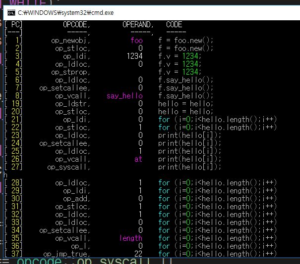

debugger
====



```cpp
compile_option opts;
opts.generate_pdb = true;

rc.compile(buf, opts);
```
```cpp
debugger dbg(out.pdb);
runner(out.program, b)
    .attach_debugger(dbg)
    .execute();
```
