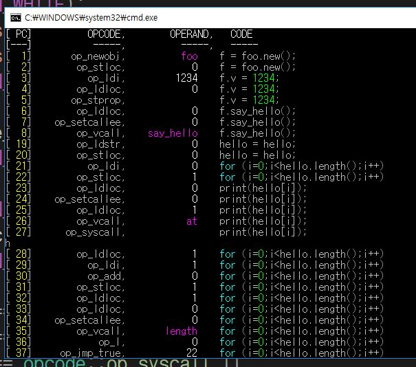

rookie
====

[](https://travis-ci.org/pjc0247/rookie.lang)

Rookie is a dynamic programming language with simple and readable syntax.



__[ONLINE PLAYGROUND](https://pjc0247.github.io/try-rookie/)__<br>
__[LANGUAGE DOCUMENTATION](https://rookielang.github.io)__

Concept
----
* Similar to C and Ruby (which means very intuitive)
* Less confusing syntax, unlike modern languages.
* Automated memory management with built in __Garbage Gollector__.
* Supports `OOP`.
* Built-in __JSON__ library.

Usage
----
```cpp
compile_option opts;
compile_output out;

out = compiler::default_compiler()
    .compile("a = 1;b = 4;", opts);

if (out.errors.empty()) {

    printf("DONE!");
}
else {
    printf("Your code has following error(s).\r\n");
    for (auto &err : out.errors)
        printf("%s\r\n", err.message.c_str());
}
```

built-in runner
----
Default implementaion of __RookieVM__.<br>
```cpp
program p; // program you built

runner().execute(p);
```

WebAssembly backend
----
__WORK IN PROGRESS__
```cpp
program p; // program you built

// This generates WAST expressions
//   We need more works to do with it.
p2wast().convert(p);
```

Run
----
* __rookie__ requires C++17.

__MSVC__<br>
Just open the `.sln` file and build it. You may require VS 2017 or higher.

__WebAssembly(emcc)__<br>
```
make
```

__Compilation Flags__

* __RK_HALT_ON_LONG_EXECUTION__
  * Prevents long execution, This option is automatically enabled in WebAssembly build.
* __RK_STRICT_CHECK__
  * Performs additional safe checks during execution. This may decreased the overall performance and not necessary for most cases.
* __RK_NO_IO__
  * Exclude Input/Output codes from build.
  

LICENSE
----
* Can be used for all purpose without any kinds of annotation.
